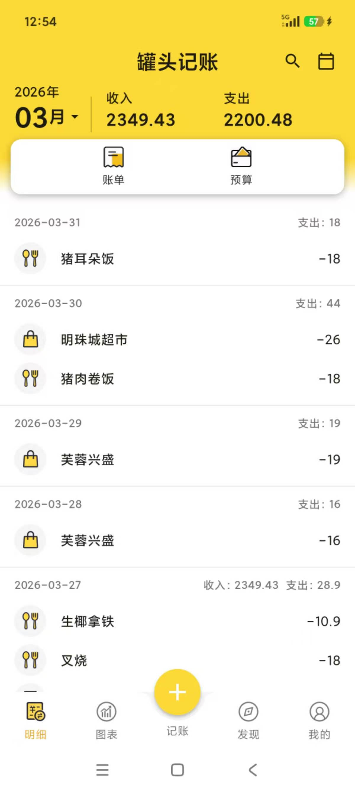
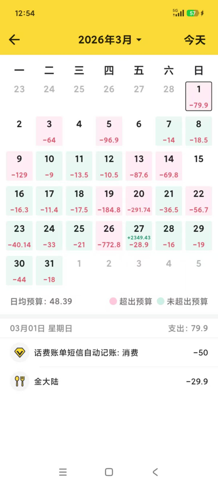
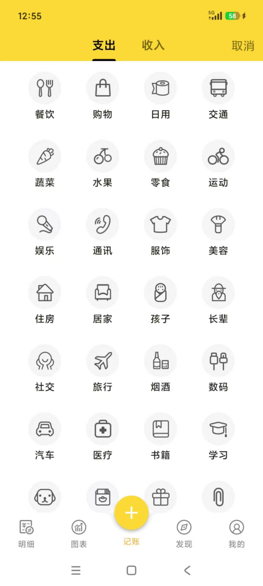
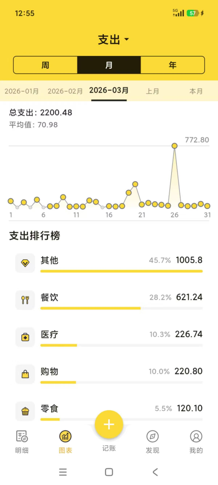
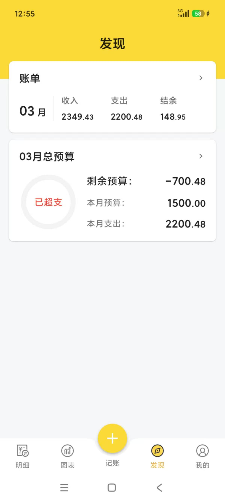
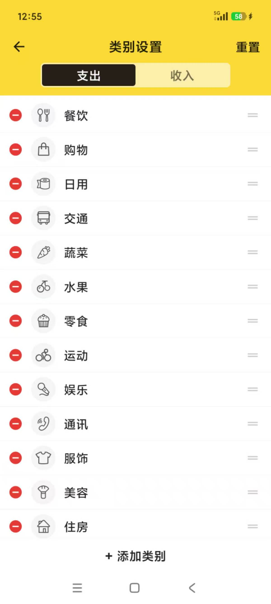
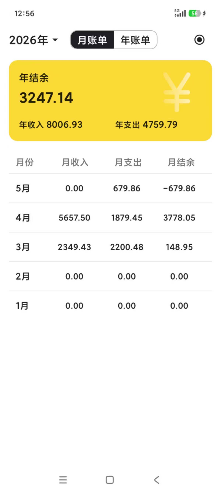
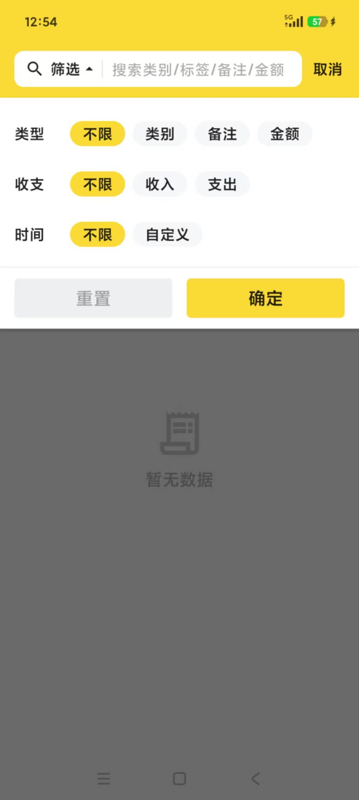

# 罐头记账flutter版

## 用flutter实现的鲨鱼记账高仿版

**目录下有apk文件自行下载体验**

- 记账功能（增删改查）
- 月/年账单功能
- 周/月/年折线图表功能
- 自定义记账类别
- 月度/年度预算功能
- 搜索功能（金额、备注、类别、时间）
- 银行短信自动记账功能
- 记账成就面板

todo：

- [ ] 数据恢复
- [ ] 记账标签
- [x] 记账日历
- [ ] 饼图分析
- [ ] 图片备注

## 本地开发和 GitHub 打包

- 本地开发直接使用 `flutter run`，不需要走打包流程。
- 数据通过 `sqflite` 保存在 Android 应用内部存储目录，属于手机本地数据。
- Android 已关闭自动备份，避免把账本数据同步到系统备份。
- GitHub 只负责打包 APK：手动触发 `build-apk` 工作流，或推送 `v*` 标签后自动生成 `app-release.apk`。
